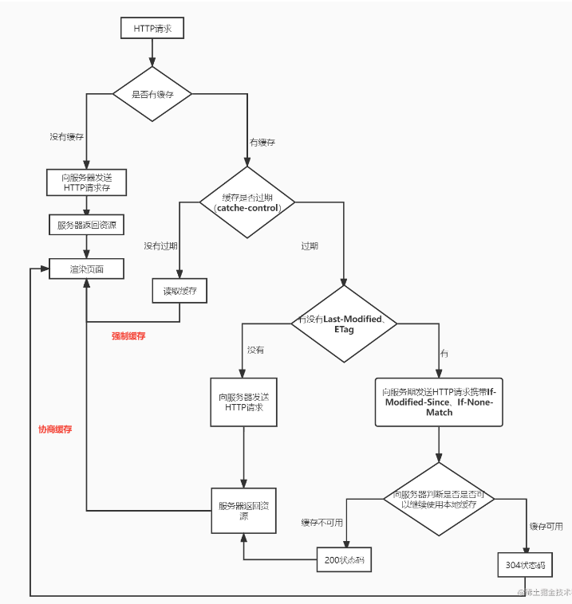

# HTTP缓存
当浏览器访问网站的时候，第一此访问的时候需要加载资源html,css,js图片，向服务器请求资源第一次之后访问可以利用缓存的功能从缓存中获取可以提高页面加载的速度，输入网址到页面加载减少网络请求的体积和数量加快页面性能。

## 强制缓存

### 强制缓存的过程
* 浏览器向服务器发送请求
* 服务器返回资源
* 浏览器再次请求先判断`max-age`有没有过期，没有过期直接从缓存里拿资源

### cache-control
通过`cache-control`设置一个最大的有效时间`max-age=300`需要缓存设置`cache-control`，不需要缓存就不设置`cache-control`,`cache-control`的设置都是有服务器通过响应头设置过来

## 协商缓存
是一种服务器的缓存策略

### 协商缓存的过程
* 浏览器向服务器发送请求
* 服务器返回资源和资源标识
* 浏览器再次发送请求和资源标识
* 如果是最新资源服务器返回`200`状态码，最新资源和新的资源标识，如果不是最新资源服务器返回304状态码直接从缓存中拿资源

### 缓存资源的资源标识
* `Last-Modified`: 资源上一次修改的时间，后续访问的时候发送请求和资源标识的字段名为`If-Modified-Sine`放在请求头中
* `ETag`:资源对应的唯一字符串后续访问的时候发送请求和资源标识的字段名为`If-None-Match`放在请求头里面，优先使用`Etag`

Last-Modified的值只精确到秒级

文件如果每隔一段时间都重复生成, 但内容相同, Last-Modified会每次返回资源文件, 即便是内容相同。但是ETag可以判断出文件内容相同就返回304, 使用缓存

## DNS缓存
了增加访问效率，计算机有域名缓存机制，当访问过某个网站并得到其IP后，会将其域名和IP缓存下来，下一次访问的时候，就不需要再请求域名服务器获取IP，直接使用缓存中的IP，提高了响应的速度。当然缓存是有有效时间的，当过了有效时间后，再次请求网站，还是需要先请求域名解析。

但是域名缓存机制也可能会带来麻烦。例如IP已变化了，仍然使用缓存中的IP来访问，将会访问失败。再如 同一个域名在内网和外网访问时所对应的IP是不同的，如在外网访问时通过外网IP映射到内网的IP。同一台电脑在外网环境下访问了此域名，再换到内网来访问此域名，在DNS缓存的作用下，也会去访问外网的IP，导致访问失败。根据情况，可以手动清除DNS缓存或者禁止DNS缓存机制。

在你的chrome浏览器中输入:chrome://dns/，你可以看到chrome浏览器的DNS缓存。系统缓存主要存在/etc/hosts(Linux系统)中

