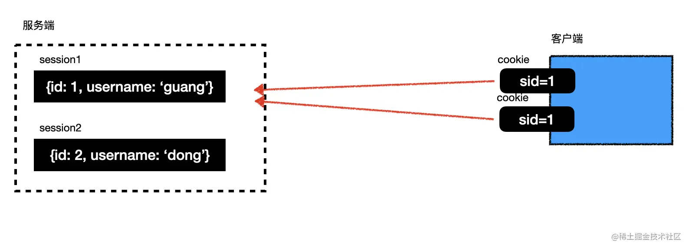

### 服务端存储的session+cookie

给http添加状态，那就给每个请求打上标记，然后在服务端存储这个标记对应的数据。这样每个被标记的请求都可以找到对应的数据，自然可以做到登录，权限等状态的存储

这个标记应该是自动带上的，所以http设计了cookie的机制，在里面存储的数据是每次请求都会带上的

然后根据cookie里的标记去查找的服务器对应的数据叫做session，这个标记就是session的id

如图，因为请求自动带上cookie，那两次请求就都可以找到id为1对应的session,自然就知道当前登录的用户是谁，也可以存储其他的状态数据

这就是session + cookie 的给http添加状态的方案

#### 缺点

###### CSRF(跨站请求伪造)钓鱼网站

解决方案： 一般会验证referer，就是请求时哪个网站发起的，如果发起请求的网站不对，那就阻止掉，如果浏览器有问题，能够伪造referer，这一般会用随机值来解决，每次随机生成一个值返回，后面再发起的请求需要包含这个值才行，否则就认为是非法的。这个随机值叫做token，可以放在参数中，也可以放在header中，因为钓鱼网站拿不到这个随机值，就算带了cookie也没发通过服务端的验证

######  分步式session 微服务项目怎么在集群中保存状态数据的同步

解决方案： 一种是session复制，也就是通过一种机制在各台机器自动复制session,并且每次修改都同步下。这个有对应的框架来做，比如java的spring-session 各台服务器都做了session复制了，那那访问任何一台都能找到对应的session

另一种方案是把session保存在redis,这样每台服务器都去那里查，只要一台服务器登录，其他服务器也就能查到session，这样就不需要复制了分布式会话的场景，redis + session 的方案更常用一点。还好，session 在分布式时的这个问题也算是有解决方案的。

###### 跨域