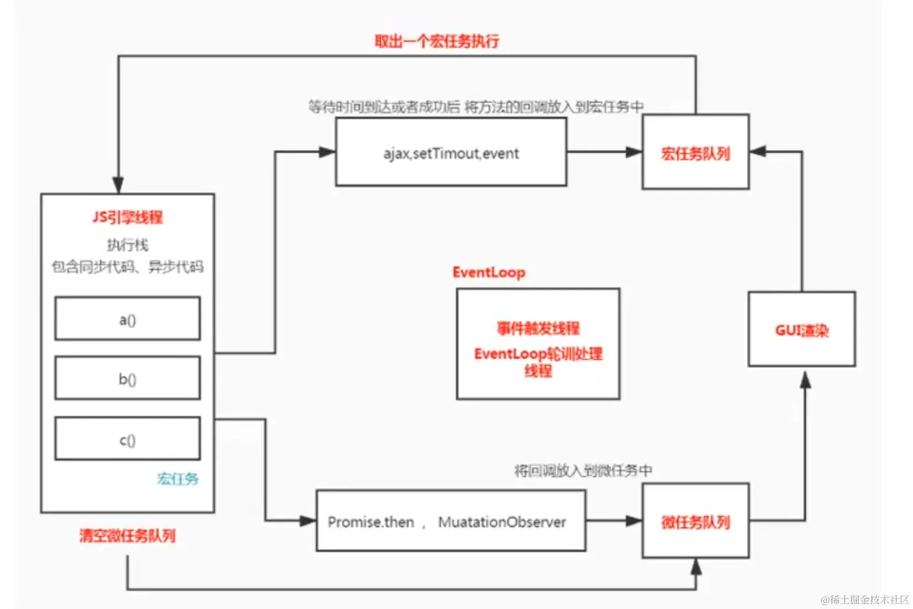

# 事件循环

## 什么是事件循环


```js
new Promise((resolve,reject)=>{
    console.log("p1-0")
    resolve()
}).then(()=>{
    console.log("p1-1")
    new Promise((resolve,reject)=>{
        console.log("p2-0")
        resolve()
    }).then(()=>{
        console.log("p2-1")
    }).then(()=>{
        console.log("p2-2")
    })
}).then(()=>{
    console.log("p1-2")
})

```

输出:
* 第一步：Promise1输出p1-0,Promise1.then进入微任务队列
* 第二步：执行Promise1.then输出p1-1，读取到Promise2，输出p2-0，Promise2.then进入微任务队列；Promise1.then读取完毕，Promise1.then.then进入微任务队列，此时微任务队列的顺序为：[Promise2.then，Promise1.then.then]
* 第三步：执行栈为空，执行微任务队列，输出p2-1，Promise2.then.then进入微任务队列，输出p1-2，此时微任务队列的顺序为：[Promise2.then.then]
* 第四步：执行栈为空，执行微任务队列，输出p2-2
输出：p1-0 p1-1 p2-0 p2-1 p1-2 p2-2