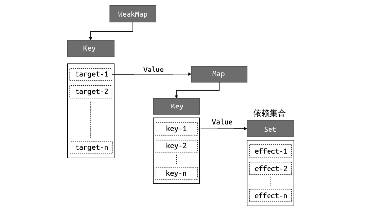

# 响应式原理
Vue.js 3 采用 Proxy 实现响应式数据，这涉及语言规范层面的知识。这部分内容包括如何根据语言规范实现对数据对象的代理，以及其中的一些重要细节。接下来，我们就从认识响应式数据和副作用函数开始，一步一步地了解响应系统的设计与实现。

## 响应式数据和副作用函数
**副作用函数**是指会产生副作用的函数
```
//这函数式存在副作用的，虽然它只会设置body的文本内容，不涉及外部状态的改变，但是除了effect函数之外的任何函数都可以读取设置body的文本内容。
function effect() {
    document.body.innerText = 'hello vue3'
}
// 副作用很容易产生，例如一个函数修改了全局变量，这其实也是一个副作用，
let val = 1
function effect() {
    val = 2
}
```
**响应式数据**
```
//假设在一个副作用函数中读取了某个对象的属性
const obj = { text: 'hello world' }
function effect() {
    document.body.innerText = obj.text
}
```
如上面的代码所示，副作用函数effect会设置body元素的innerText属性，其值为obj.text,当obj.text的值发生变化时，我们希望副作用函数会重新执行

## 响应式数据的基本实现
```
//存储副作用函数的桶
const bucket = new Set()

//原始数据
const data = { text: 'hello world' } 
// 对原始数据的代理
const obj = new Proxy(data, {
    //拦截读取操作
    get(target, key) {
        //将副作用函数添加到存储副作用函数的桶中
        bucket.add(effect)
        //返回属性值
        return target[key]
    },
    //拦截设置操作
    set(target, key, newVal) {
        /设置属性值
        target[key] = newVal
        //把副作用函数从桶里取出并执行
        bucket.forEach(fn => fn())
        //返回true代表设置操作成功
        return true
    }
})

```

首先，我们创建了一个用于存储副作用函数的桶 bucket，它是Set 类型。接着定义原始数据 data，obj 是原始数据的代理对象，我们分别设置了 get 和 set 拦截函数，用于拦截读取和设置操作。当读取属性时将副作用函数 effect 添加到桶里，即bucket.add(effect)，然后返回属性值；当设置属性值时先更新原始数据，再将副作用函数从桶里取出并重新执行，这样我们就实现了响应式数据。

**缺陷**：副作用函数采用了硬编码的方式，导致名字不能修改



## 为什么使用Reflect
Reflect可以接收地第三个参数，即指定接收者**receiver**，你可以把它理解为函数调用过程中的this。
```
 const obj = {
   foo: 1, 
   get bar() { 
   // 这里的 this 指向的是谁？ 
   return this.foo
    }
}
```
当我们通过obj.bar触发响应式时，不使用Reflect.get()完成读取，会导致getter函数内的this始终指向原始对象，这样就不会建立响应式联系。导致无法响应


